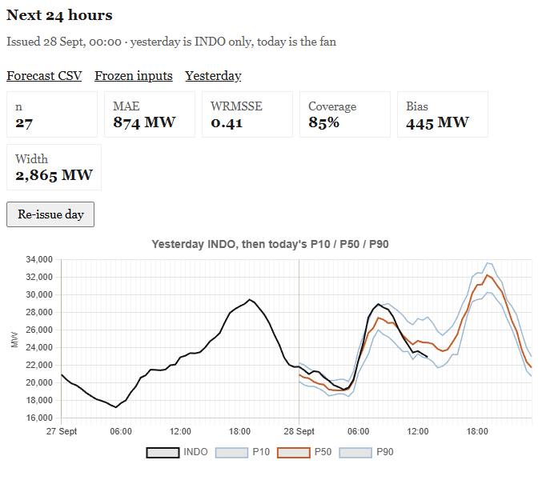

# GB National Demand forecast — systems architecture

Live **P10 / P50 / P90** forecast of Great Britain National Demand. Weather in, quantiles out, scored against Elexon Insights **INDO** after each settlement period. Built as a production service, not a notebook dump.

Source: [github.com/lbransby1/energy-forecast](https://github.com/lbransby1/energy-forecast). This document is the architecture view for software and ML engineering. Skills narrative: [`technical-writeup.md`](technical-writeup.md).

```
Open-Meteo (ERA5 / forecast / Previous Runs)     NESO ND (historic CSV)
                    \                                    /
                     \                                  /
                      v                                v
                 feature store (parquet)  <---- Insights INDO (live)
                              |
                              v
              LightGBM packs: hour | day | week
                              |
                              v
                    FastAPI  :8000
                    GET /           HTML dashboard (static)
                    GET /board      local parquet JSON (fast path)
                    POST /capture   issue forecasts (slow path)
                              |
                              v
                 data/live/board.parquet + frozen features
```

---

## 1. Problem and product

| Preset | Issue rule | Model pack | Horizon |
|---|---|---|---|
| **next30** | every half-hour (:10 / :40 London) | hour (ERA5 + `lag_1`/`lag_2`) | next settlement period |
| **day** | midnight London, freeze | day (Previous Runs) | 24 h |
| **week** | Monday 00:00 London, freeze | week (Previous Runs, Optuna) | 168 h |

The live contract: **write the forecast first**, join INDO only after that period has ended. Holdout MAE is not the score that matters; the board is. Yesterday is **INDO only** (what happened). Today is the **issued fan** (P10 / P50 / P90). Elapsed hours of today get a black INDO overlay as Insights publishes. The day pack is not seeded with yesterday’s predictions; it runs forward from the midnight freeze.

Live demo: [energy-forecast-production.up.railway.app](https://energy-forecast-production.up.railway.app)



*Day freeze, 28 Sept 2026 ~13:00 London. n = 27 scored half-hours so far; MAE 874 MW; WRMSSE 0.41; 80% interval coverage 85%; bias +445 MW. Grey/black before midnight is yesterday’s outturn, not a hindcast.*

Regional / GSP series are out of scope: there is no public live actual.

---

## 2. Runtime architecture

### 2.1 Process

One **uvicorn** worker (file-backed state is not safe across multiple writers). FastAPI lifespan starts a capture loop. `EF_SKIP_CAPTURE=1` disables it (tests).

| Path | Cost | Does |
|---|---|---|
| `GET /` `GET /health` | milliseconds | HTML / `{ok: true}` |
| `GET /board` | local parquet | charts + MAE/coverage; **no Insights/Open-Meteo** |
| `POST /capture` | seconds–tens of seconds, **background thread** | weather fetch, LightGBM, freeze, INDO join, WRMSSE cache |

WRMSSE needs 56 days of INDO. It is computed on the **capture loop**, cached in `data/live/wrmsse_cache.json`, and only *read* on `/board`.

### 2.2 Data plane

```
data/raw/demanddata_*.csv     historic ND (committed; Docker/Railway image)
data/models/{hour,day,.}/     LightGBM artefacts (~20 MB, committed)
data/processed/               INDO + weather caches (volume, gitignored)
data/live/                    board, archive, frozen snapshots (volume, gitignored)
```

INDO cache writes are **atomic** (temp + `os.replace`) and **locked** so `/board` and capture cannot tear the parquet.

### 2.3 Time

Settlement timestamps are **Europe/London** period starts, including DST 46/50-period days. INDO for period `T` exists only after `T+30min`. Joins are exact timestamp, not hour-floor, when `settlement_period` is present.

---

## 3. ML architecture

Two-phase LightGBM: **mean** booster, then **residual quantiles** P10/P50/P90. P50 is not the mean. Interval scale targets ~80% coverage; the week fan **widens with lead**.

| Pack | Weather in train | Short lags | Live route |
|---|---|---|---|
| Hour | ERA5 | last published INDO | `lead ≤ 1 h` |
| Day | Previous Runs | no | `1 < lead ≤ 24 h` |
| Week | Previous Runs | no | `lead > 24 h` |

COVID years 2020–2023 are out of day/week training. Hour pack may use 2022–2023.

**Leakage rule:** day/week holdout weather is Previous Runs (what would have been available at issue), not perfect ERA5.

Features: calendar + UK holidays, HDD/CDD (15.5 °C), weather trajectory (past rolls + **forward** 12h/24h on the forecast path), lags 1/2/48/336. Climatology fills only 48/336. Holiday extra flags were tried and **reverted** — trees still followed `lag_48` on the day after a bank holiday.

Eval: 56-day holdout at display frequency; WRMSSE vs weekly seasonal naive (1.0 = copy last week); skill vs climatology; SHAP on mean/P10/P90 of the pack that scored the row; case notebook for holiday / clock-change / hot day.

---

## 4. Live scoring and safety

- **Frozen feature parquet** at issue: weather, lags, last INDO. Day/week overwrites are the trial; week re-issue requires `WEEK_REISSUE_PASSWORD`.
- **Context INDO** (`data/live/context_actuals.parquet`): last week of published outturn, written on the capture loop so a cold volume still shows yesterday / last week as the grey line. `GET /board` only reads the file.
- Hour pack **stamps `lag_1`/`lag_2` from Insights** immediately before predict. If last INDO is older than 90 minutes, skip the 30-minute call.
- Capture at **:10 and :40** so the previous SP is usually published.

---

## 5. HTTP API

| Method | Path | Notes |
|---|---|---|
| GET | `/` | Dashboard |
| GET | `/health` | Railway healthcheck |
| GET | `/board` | Fast JSON |
| GET | `/download/{preset}` | Forecast CSV |
| GET | `/download/{preset}/frozen` | Frozen inputs |
| GET | `/inputs/{preset}` | Input check (may hit Insights) |
| POST | `/capture` | Due presets (`LIVE_TOKEN` if set) |
| POST | `/capture/{preset}` | Force one pack; week needs `X-Week-Password` |

---

## 6. CI/CD and deploy

**GitHub Actions** (`.github/workflows/ci.yml`): Python 3.11, `pip install -e ".[dev]"`, `pytest`.

**Railway** (Dockerfile):

1. New project → Deploy from GitHub repo.
2. Builder: Dockerfile (`railway.toml`).
3. Volume mount `data/live` (and optionally `data/processed`) so the board survives deploys.
4. Variables: `WEEK_REISSUE_PASSWORD`, optional `LIVE_TOKEN`, optional `WANDB_PROJECT_URL` / `MLFLOW_UI_URL` (lab column links), `PORT` (Railway injects this).
5. Healthcheck: `GET /health`.

First capture on a cold box fetches weather and is slow. The **website** stays fast because `/` and `/board` do not wait on that.

Local:

```bash
python -m venv .venv
.venv\Scripts\activate
pip install -e ".[dev]"
pytest -q
uvicorn energy_forecast.app:app --host 127.0.0.1 --port 8000
```

Docker:

```bash
docker compose up --build
```

---

## 7. Holdout snapshot (not the live board)

| Product | Horizon | Holdout MAE | 80% coverage | WRMSSE |
|---|---|---:|---:|---:|
| Short | 24 h hourly | 834 MW | 82% | 0.37 |
| Medium | 7 d (6 h eval) | 870 MW | 90% | 0.41 |

---

## 8. Layout

```
src/energy_forecast/    library + FastAPI app
tests/                  pytest (no live APIs)
notebooks/              EDA → train → eval → Optuna → SHAP → cases
docs/                   README figures (live board screenshot)
data/models/            committed artefacts
data/raw/               NESO ND CSVs
data/live/              runtime board (gitignored)
.github/workflows/ci.yml
Dockerfile  railway.toml  docker-compose.yml
```
